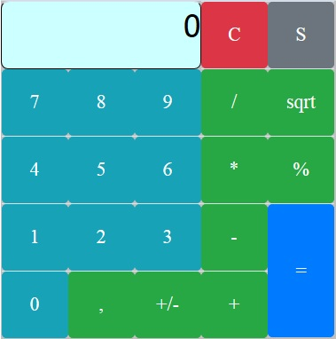
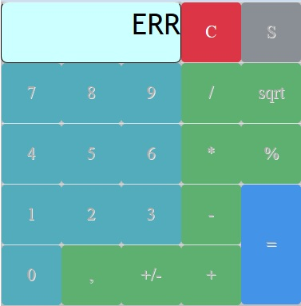
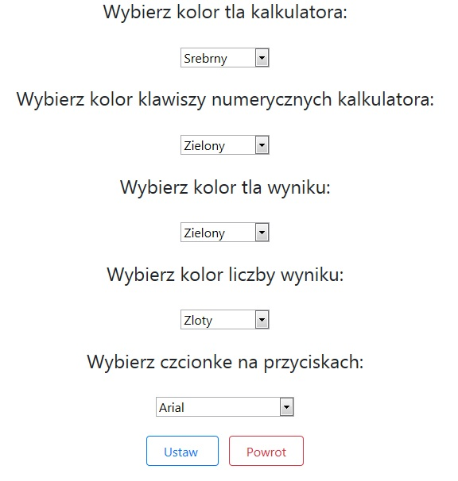
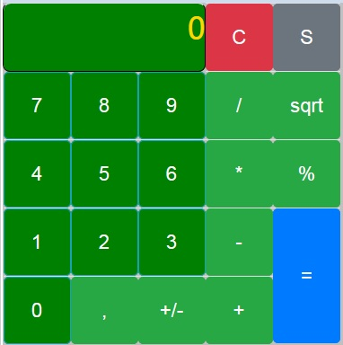
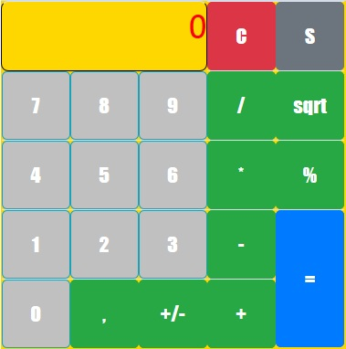

## Table of contents
* [Application name](#application-name)
* [Screenshots](#screenshots)
* [General info](#general-info)
* [Technologies](#technologies)
* [Author](#author)

## Application name
Calculator JSF Application with Settings.

## Screenshots
* App screenshot       
      
* App error e.g. when clicked `1/0=`        
     
* App settings    
      
* App appearance after changing the settings           
       
* App appearance after changing the settings           
     

## General info  
Calculator with styles/font/colors settings using JavaEE, JavaServer Faces, Java 8, CSS, Bootstrap 4.5.0, HTML5/XHTML, XML and server Glassfish 5.        
	
## Technologies
Project was created with:
* Java 8
* JavaEE
* HTML5 / XHTML
* XML
* CSS
* Bootstrap 4.5.0
* JSF
* using server Glassfish 5.0

## Author
Marcin Godlewski
